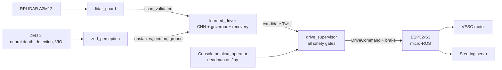

# Overview

[Index](README.md) · Next: [System architecture](02_system_architecture.md)

## What this work is

LAKSA is a 1/10-scale Ackermann RC car. An ESP32-S3 drives the VESC motor controller and the steering servo. A Jetson Orin Nano runs ROS 2 Humble with an RPLIDAR A2M12 and a ZED 2i stereo camera.

This branch, `feature/learned-driver`, adds a **machine-learned driver**: a small neural network that looks at one LiDAR scan and chooses a steering angle and a speed. Around it are:

- a **camera perception layer** built on the ZED SDK's neural depth and object detection;
- a **rule-based safety layer** that can always stop the car, whatever the network decides;
- a **browser console and a terminal operator** to start and stop the car without an Xbox controller;
- **boot services** that bring everything up at power-on, with a hotspot for use at the field;
- a **per-run session recorder**, so every drive can be reviewed afterwards.

The goal was a model that is **fast at run time** and **needs little training**. It trains in about 24 minutes on a laptop CPU and runs in about 2 ms per scan on the Jetson, in plain NumPy.

## Status at a glance

| Area | Status |
|---|---|
| Learned driver, simulation | Done. Matches the expert driver on unseen tracks and the competition course from 0.24 to 2.0 m/s |
| Learned driver, real car | **Driven autonomously**: indoors, stopped before a box; outdoors, drives of 38 s and 86 s |
| Clearance governor (always able to stop) | Done, tested on the car |
| Steering around obstacles | Deployed; checked on live scans, not yet driven |
| Camera obstacles, person rules, slope handling | Deployed. Slope handling still needs a test on real sloped ground |
| Steering smoothing | Deployed after the field test showed stutter |
| Reverse-away recovery | Logic works, but **the car does not actually reverse** (open issue) |
| Console (map, camera, HOLD TO RUN, EXPLORE, STOP) | Done. Start and end markers are placed but **no route is planned yet** |
| Boot services, hotspot, fixed console link | Done. The live home-to-hotspot switch still needs a field re-test |
| Session recording | Done: a folder per start with logs, a bag and the map database |
| Jetson load | Reduced; see [Performance](09_performance_optimization.md) |

Speed is deliberately capped at **0.15 m/s** in trial mode (0.24 m/s in dry-run).

## How the pieces fit

The learned driver **never commands the motor itself**. It only proposes a command. `drive_supervisor` forwards it only while an operator is present and every safety check passes. See [Runtime safety](05_runtime_safety.md).

## Timeline

Dates are local time (CDT).

| Date | What happened |
|---|---|
| 24 Sep | Full repository review. The PPO reinforcement-learning attempt was scrapped in favour of imitation learning (TinyLidarNet-style). Simulator moved to F1TENTH Gym `v1.0.0`. First training run. |
| 24–25 Sep | Training parallelised across CPU workers; the v2 model trained in about 24 min; held-out evaluation. |
| 25 Sep | Message-interface mismatch resolved by adopting the `autonomy-handoff-2026-09-02` fields (`DriveCommand.brake`, VESC telemetry counters). |
| 26 Sep | Bench Jetson (Orin Nano Super, JetPack 6) set up: ROS 2 Humble, third-party packages, all LAKSA packages built. |
| 28 Sep | Read-only check of the ESP32 link; steering bench and wheels-up traction bench; TF tree fixed; ZED wrapper built; terminal operator; **first autonomous run on the floor**; reverse recovery; camera perception with ZED object detection; console; hotspot and fixed link; boot services. |
| 28 Sep (evening) | **Field test outdoors**. Found steering stutter, phantom camera obstacles in the dark, slope treated as a wall, visual-odometry jumps and an overloaded Jetson. All addressed the same night. |
| 28 Sep (late) | CPU optimisation pass and this documentation. |

## What is not done

See [Known issues and next steps](11_known_issues_and_next_steps.md). The main ones:

- reverse does not move the car;
- start and end points don't plan a route yet;
- the model fails at 3 m/s with randomised conditions on the competition course;
- slope handling and the live network switch still need field confirmation.
