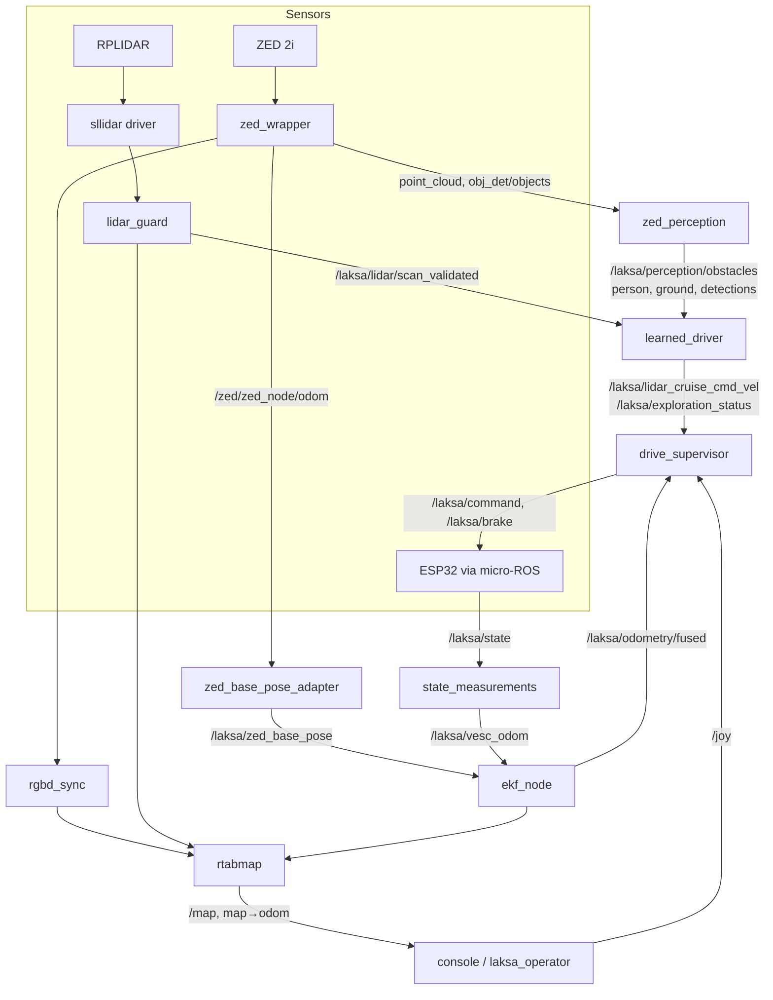
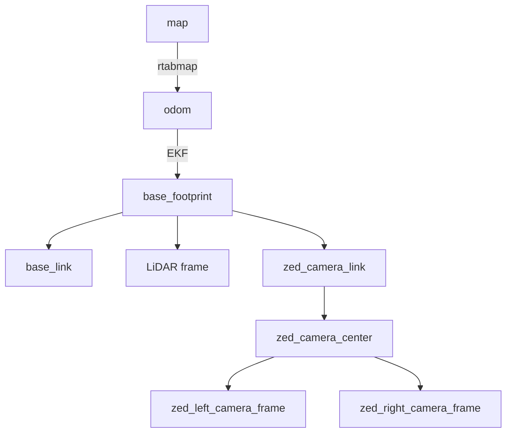

# System architecture

[Index](README.md) · Previous: [Overview](01_overview.md) · Next: [Models](03_models.md)

## Hardware

| Part | Role | Link to Jetson |
|---|---|---|
| Jetson Orin Nano Super (8 GB, JetPack 6, Ubuntu 22.04) | Runs all ROS 2 software | — |
| ESP32-S3 | Motor and steering controller, IMU, watchdog | USB serial, micro-ROS (FastDDS, domain 0) |
| VESC | Brushless motor controller | UART to the ESP32 |
| PCA9685 + servo | Steering | I2C from the ESP32 |
| BNO08x | IMU, reported on `/laksa/state` (not fused by the field EKF) | via the ESP32 |
| RPLIDAR A2M12 | 2-D LiDAR, ~13 Hz, mounted at the front above the camera, about 13.5 cm above the ground | USB (`/dev/laksa_lidar`) |
| ZED 2i | Stereo camera: neural depth, visual-inertial odometry, object detection | USB 3 |

Vehicle geometry used everywhere (simulator, model, governor): wheelbase 0.324 m; footprint 0.419 m in front of and 0.149 m behind `base_footprint` (the rear axle), half-width 0.148 m; LiDAR at x = 0.31542 m; steering limits 0.523 rad left and 0.288 rad right.

## Process map

Everything is started by `firmware/esp32-s3/jetson/setup/dryrun_bringup.sh` (see [Setup and deployment](08_setup_and_deployment.md)). The micro-ROS agent that bridges the ESP32 is a pre-existing boot service and is reused, never restarted.

| Process | Package | Purpose |
|---|---|---|
| `description` | `laksa_description` | Robot model and static TF |
| `lidar` | `laksa_bringup` (`sllidar_ros2`) | LiDAR driver |
| `lidar_guard` | `laksa_lidar` | Validates each scan (geometry, timing, TF) and republishes it unchanged as `/laksa/lidar/scan_validated` |
| `zed` | `zed_wrapper` | ZED SDK: depth, point cloud, VIO odometry, object detection |
| `zed_base_pose` | `laksa_mapping` | Converts the camera pose into the car's base pose |
| `state_measurements` | `laksa_bringup` | Measured VESC speed as odometry (`/laksa/vesc_odom`); also republishes the BNO08x IMU, which the field EKF doesn't use |
| `ekf` | `robot_localization` | Fuses the ZED base pose (x, y, yaw) and VESC speed into `/laksa/odometry/fused` and `odom → base_footprint` |
| `zed_perception` | `laksa_learned_driver` | Camera obstacles, person rule, ground plane |
| `learned_driver` | `laksa_learned_driver` | Neural network + clearance governor + recovery + smoothing |
| `supervisor` | `laksa_bringup` | `drive_supervisor`: the only node that commands the ESP32 |
| `rgbd_sync`, `rtabmap` | `rtabmap_ros` | Mapping (RTAB-Map) from camera + LiDAR + fused odometry |
| `recorder` | `rosbag2` | Compact recording of each session |
| `console` | `laksa_learned_driver` | Browser console (map, camera, controls) |

## Data flow

## Key topics

| Topic | Type | Publisher → consumer |
|---|---|---|
| `/laksa/lidar/scan_validated` | `LaserScan` | lidar_guard → learned_driver, supervisor (freshness only), rtabmap, console |
| `/laksa/perception/obstacles` | `PointCloud2` (x, y in `base_footprint`) | zed_perception → learned_driver |
| `/laksa/perception/person` | `String` JSON `{factor, stop, nearest_m}` | zed_perception → learned_driver, console |
| `/laksa/perception/ground` | `String` JSON `{plane: [a, b, c]}` | zed_perception → learned_driver |
| `/laksa/perception/detections` | `String` JSON list | zed_perception → console |
| `/laksa/lidar_cruise_cmd_vel` | `Twist` | learned_driver → supervisor (the "LiDAR Cruise" slot) |
| `/laksa/exploration_enabled` | `Bool` (latched) | supervisor → learned_driver |
| `/laksa/exploration_status` | `String` (latched) | learned_driver → supervisor, console |
| `/joy` | `Joy` | console / laksa_operator (or an Xbox) → supervisor |
| `/laksa/command` | `laksa_interfaces/DriveCommand` | supervisor → ESP32 |
| `/laksa/brake` | `Bool` | supervisor → ESP32 |
| `/laksa/state`, `/laksa/vesc/state` | `VehicleState`, `VescState` | ESP32 → supervisor, console, state_measurements |
| `/laksa/odometry/fused` | `Odometry` | ekf → supervisor, rtabmap, console |
| `/laksa/mission_state`, `/laksa/autonomy_health`, `/laksa/emergency_stop` | status | supervisor → console, operator |
| `/map` | `OccupancyGrid` | rtabmap → console, supervisor |
| `/laksa/console/start`, `/laksa/console/goal` | `PoseStamped` (latched) | console → (future route planner) |

## TF tree

- `base_footprint` is the root of the robot model. The URDF was changed on this branch to root it there. It had been rooted at `zed_camera_link`, which gave `base_footprint` two parents once the EKF published `odom → base_footprint`.
- The ZED publishes **no** odometry TF (`publish_tf:=false`). Its pose goes through `zed_base_pose_adapter` into the EKF instead.
- The ZED's 200 Hz IMU transform is turned off (`publish_imu_tf:=false`): nothing uses it, and it was 75% of all `/tf` traffic. See [Performance](09_performance_optimization.md).

## Control authority

There is exactly **one** path to the motor, and the learned driver is not on it:

1. The learned driver publishes a **candidate** `Twist` on `/laksa/lidar_cruise_cmd_vel`.
2. `drive_supervisor` forwards it only in `LIDAR_CRUISE` mode. It enters that mode when an operator holds **A for 3 s** on `/joy`: from an Xbox, the console or `laksa_operator`.
3. The supervisor checks every gate, applies its own speed cap, converts to `DriveCommand` and publishes `/laksa/command` and `/laksa/brake`.
4. The ESP32 has its own 500 ms command watchdog: if commands stop, it stops the motor.

The learned driver refuses to drive if a second node publishes on its command topic (`CONTROL_ERROR`). This guards against starting it next to the older rule-based `lidar_cruise_node.py`.

## Message interface

This branch uses the **autonomy-handoff** message fields, which match the firmware on the ESP32 (verified read-only on 28 Sep):

- `DriveCommand.brake`: request active VESC braking instead of coasting at zero RPM.
- `VescState.brake_active`, `telemetry_sequence`, `telemetry_age_ms`: lets the Jetson tell fresh VESC telemetry from stale.

`Pca9685State` (steering diagnostics) is kept as well. See [Change log](12_change_log.md).
