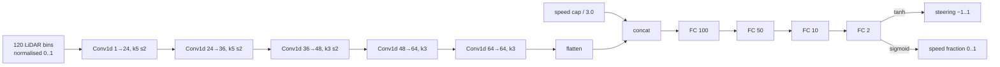

# Models

[Index](README.md) · Previous: [System architecture](02_system_architecture.md) · Next: [Training pipeline](04_training_pipeline.md)

## Models at a glance

| Model | Kind | Where it runs | What it decides |
|---|---|---|---|
| **LAKSA TinyLidarNet v5** (ours; v2 is the previous default) | 1-D CNN, 94,746 parameters, imitation-learned | Jetson CPU, NumPy, about 2 ms per scan | Steering angle and target speed from one LiDAR scan |
| ZED **NEURAL_LIGHT** depth | Stereo depth network (ZED SDK 5.5) | Jetson GPU | Depth map and point cloud for camera obstacles and mapping |
| ZED **MULTI_CLASS_BOX_FAST** | Object detector with 3-D boxes and tracking (ZED SDK) | Jetson GPU | People, vehicles, bags, animals, electronics and similar, as 3-D boxes |
| ZED **GEN_3 positional tracking** | Visual-inertial odometry (ZED SDK) | Jetson GPU/CPU | Camera pose, the main odometry source |
| Expert driver (training only) | Smoothed raceline, curvature speed profile, pure pursuit | Simulator | Labels every training state |
| EKF (`robot_localization`) | Kalman filter, not learned | Jetson | Fuses the ZED pose and VESC speed into `/laksa/odometry/fused` |
| RTAB-Map | Graph SLAM, not learned | Jetson | The map shown in the console |

Only the first model is trained by this project. The ZED models are Stereolabs' built-in networks, chosen and configured here (see [Camera perception](06_camera_perception.md)).

## Why imitation learning and not PPO

The earlier uncommitted attempt trained PPO (reinforcement learning) in F1TENTH Gym. It was archived to `scratch/archive_ppo/` and replaced because:

- **PPO needs millions of steps** plus careful reward shaping. The archived script's crash penalty never fired: it read `info['collision']`, which the simulator never sets.
- **Imitation learning needs minutes.** A privileged expert, which knows the true pose and the track, drives in simulation. The network learns to copy it from LiDAR alone.
- **TinyLidarNet** (Zarrar et al.) showed that this kind of small 1-D CNN, trained on LiDAR by imitation, races well on real F1TENTH cars.
- **The student needs no map, localization or TF at run time.** When this started, those were the least reliable parts of the car.

## Network architecture

- ReLU after every layer except the output.
- **Steering** is decoded asymmetrically: +1 maps to 0.523 rad left and −1 to 0.288 rad right, matching the car's real limits.
- **Speed** = sigmoid output × the speed cap. The cap is also an *input*, so the network drives more carefully at higher caps.
- Defined in `laksa_learned_driver/training/model.py` (PyTorch, training only). Run on the Jetson by `laksa_learned_driver/policy.py` in NumPy, with no PyTorch or ONNX needed on the car.

## Input contract

Implemented once in `scan_features.py` and shared by the simulator and the car, so training and deployment can't drift apart:

| Item | Value |
|---|---|
| Field of view | front 180° (−90° to +90°, vehicle frame, positive = left) |
| Bins | 120 bins of 1.5°, each the **minimum** valid range in its sector (conservative for obstacles) |
| Range | clipped to 0.05–10 m; "no return" counts as 10 m; empty bins are interpolated |
| Origin | the physical LiDAR position, x = 0.31542 m ahead of `base_footprint` |
| Rate | one decision per scan, about 12.5 Hz |

`scan_adapter.py` converts the raw RPLIDAR scan into this frame. It applies the mount yaw (π for this mount) and removes returns that fall on the car's own body.

## Output contract

| Output | Range |
|---|---|
| Road-wheel steering | 0.523 rad left to 0.288 rad right |
| Target speed | 0 to the speed cap (trained on caps of 0.25–3.0 m/s) |

The driver node converts steering and speed into a `Twist`: `angular.z = v·tan(δ)/L`.

## Model file

`firmware/esp32-s3/jetson/laksa_learned_driver/models/`:

| File | Content |
|---|---|
| `laksa_tinylidarnet_v5.npz` | **The default** (driver, launch file, probe and tests). All weights plus a JSON metadata block (format `laksa-learned-driver-v1`, scan and output contracts, training summary). SHA-256 `3e7ff9ec1148c794c6ffe0c4fcd507b0cbf56c24d844a5a640e9bcdaf47a7cf4` |
| `laksa_tinylidarnet_v2.npz` | The first shipped model (plain corridors only). SHA-256 `2940c8d0122e928aac9de3cc2fd102c5bbf6377005e370c4d8376708c5472ad3` |
| `laksa_tinylidarnet_v3.npz`, `v4.npz` | Intermediate obstacle- and course-trained models |
| `*.report.json` | Full training report per model: per-round data size, losses and evaluation, expert baseline, arguments |

The policy loader rejects any file whose format tag or first-layer shape doesn't match.

## What the network does and does not do

| Handled by the network | Handled by rules around it ([Runtime safety](05_runtime_safety.md)) |
|---|---|
| Steering toward open space and following corridors | Stopping before obstacles (clearance governor) |
| Choosing a speed up to the cap | Reversing away when blocked (recovery state machine) |
| | Slowing or stopping for people (camera person rule) |
| | Smoothing its steering (low-pass filter and rate limit) |

v2 was trained only on **forward driving in obstacle-free corridors** 0.9–2.2 m wide; v5 adds boxes, buckets, 2026 course-style sections and the Obstacle Course replica ([Training](04_training_pipeline.md#obstacles-and-the-2026-courses-in-progress)). Neither was trained to stop, reverse or react to people. That is why the rule-based layer exists and always has the last word.
