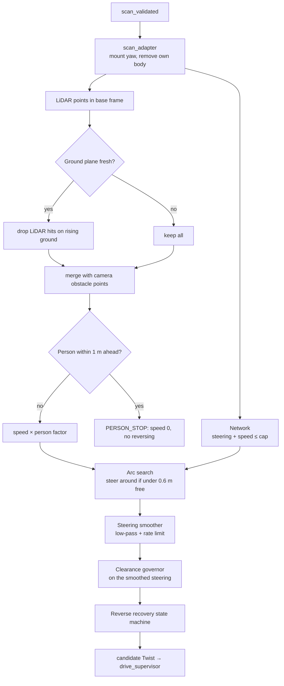
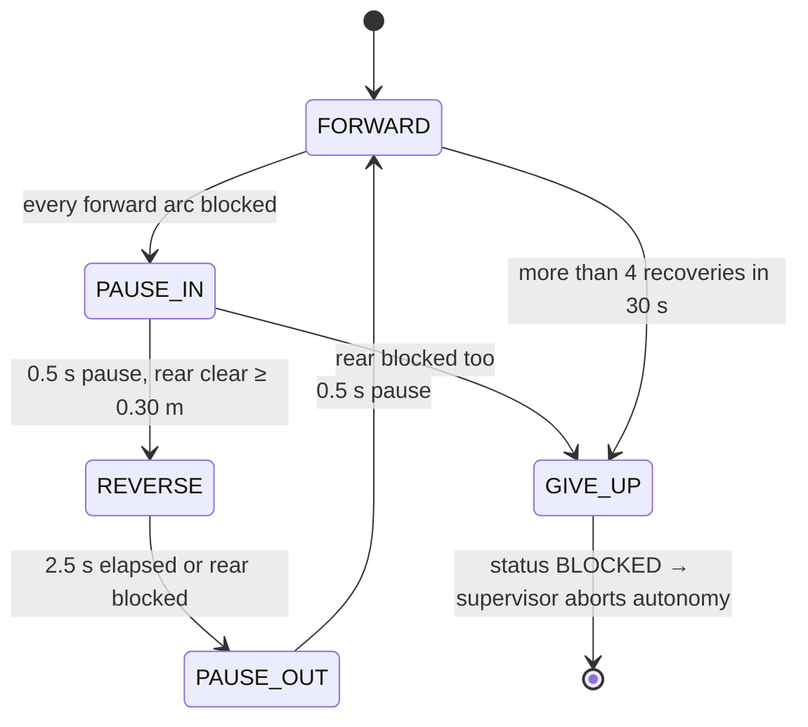

# Runtime driving and safety

[Index](README.md) · Previous: [Training pipeline](04_training_pipeline.md) · Next: [Camera perception](06_camera_perception.md)

The network only proposes a direction and a speed. Several independent rule-based layers sit between it and the motor, and **any one of them can stop the car**.

## Per-scan pipeline

Implemented in `laksa_learned_driver/driver_node.py`, and run once per LiDAR scan (about 13 Hz):

## Clearance governor

`safety.py`. This layer works on raw points, not on the network's features:

- It traces the car's **swept corridor** along the commanded constant-curvature arc: half-width 0.148 m plus 0.10 m margin, out to 4 m.
- It finds the arc length from the front bumper to the **first obstacle point inside that corridor**. LiDAR and camera points both count.
- It caps speed so the car can stop before it. The cap is the largest `v` with `v·latency + v²/(2·decel) ≤ free − margin`, using latency 0.25 s, deceleration 1.0 m/s² and margin 0.25 m.
- If `free − margin ≤ 0`, the path is **blocked**.

Points that are already **beside** the body, behind the bumper but outside the footprint, count only when the car turns toward them. Going straight or turning away never brings the body closer, but a turn toward them can clip them with the front corner. Points inside the footprint always block. Before this rule, an object 8 cm off the car's side made every arc read "0.00 m free".

## Steering around obstacles

`safety.choose_steering`, run on every scan before the governor:

- If the network's arc has at least **0.60 m** free ahead of the bumper (`avoid_clearance_m`), it is kept unchanged.
- Otherwise the driver tries **17 arcs** across the full steering range and takes the one **closest to the network's choice** that has 0.60 m free. The status becomes `AVOIDING`.
- If no arc has 0.60 m free, it takes the arc with the most room.
- An ongoing detour is kept while it still has room, so the car doesn't flip between a left and a right detour.
- The detour target goes through the steering smoother, and the governor checks the steering **actually commanded**. While the wheels swing toward the detour, the car waits instead of driving into the obstacle.
- The reverse recovery starts only when **no** arc is free (`all_blocked`).
- `avoid_enabled: false` turns this off.

The `target_steer` column in `decisions.csv` records the detour target.

## Reverse recovery

`recovery.py` is a small state machine:

- Reverse speed is 0.12 m/s (never above the cap), for up to 2.5 s (about 0.3 m).
- The wheels turn **toward** the obstacle's side while reversing, which swings the nose away from it.
- The rear corridor (behind the 0.149 m rear overhang, slightly widened) is checked with the LiDAR's rear returns **before and throughout** each reverse.
- **Known issue:** the logic commands reverse correctly, but the car doesn't physically move backwards. See [Known issues](11_known_issues_and_next_steps.md).

## Steering smoothing

`smoothing.py`. This was added after the field test showed stutter. The network decides each scan independently, and outdoors (unlike its training data) consecutive outputs jumped. The fix is an exponential low-pass (α = 0.4) followed by a rate limit of 1.0 rad/s on the commanded angle. It changes how fast the car turns, not where it's trying to go.

## Person rule

From the camera (see [Camera perception](06_camera_perception.md)). For people within a ±60° cone ahead:

| Distance ahead of the bumper | Action |
|---|---|
| ≤ 1.0 m | `PERSON_STOP`: speed 0, and no reverse manoeuvre near people |
| ≤ 2.0 m | speed × 0.5 |
| further | normal |

People's detected footprints are also enlarged by 0.25 m before being added to the governor's obstacle points.

## Driver status values

Published on `/laksa/exploration_status` and shown in the console:

| Status | Meaning |
|---|---|
| `IDLE` | not enabled by the supervisor |
| `WAITING_FOR_SCAN` | just enabled |
| `LEARNED_DRIVING` | the network is driving |
| `AVOIDING` | steering around an obstacle on the network's arc |
| `RECOVERY_PAUSE`, `RECOVERY_REVERSE` | the recovery is running |
| `PERSON_STOP` | holding for a person |
| `BLOCKED` | gave up; the supervisor aborts autonomy (`EXPLORATION_BLOCKED`) |
| `SCAN_TIMEOUT`, `INVALID_SCAN` | LiDAR input problem; publishes zero |
| `CONTROL_ERROR` | another node is also publishing the command topic, or a non-finite output; refuses to drive |

## Supervisor gates

`laksa_bringup/scripts/drive_supervisor_node.py` forwards the driver's command only if **all** of these hold, and brakes otherwise:

- An operator is present: fresh `/joy`, from an Xbox, the console or `laksa_operator`. `LIDAR_CRUISE` needs **A held for 3 s**.
- The emergency stop isn't latched: B latches it, Y rearms.
- The ESP32 state is fresh, VESC telemetry is fresh (sequence counter and age), and there is no VESC fault.
- LiDAR, fused odometry and the ZED point cloud are fresh. Odometry jumps are rejected.
- The driver hasn't reported `BLOCKED`.
- The command is within the speed cap `exploration_max_erpm`: **620 eRPM (about 0.15 m/s) in trial mode**, 1000 eRPM (about 0.24 m/s) in dry-run. The driver applies its own cap too (`speed_cap_mps`: 0.15 in trial, 0.24 in dry-run).
- In dry-run mode (`actuation_enabled:=false`), every command is replaced by brake, but the would-be command is still published for inspection.

## Ways the car stops

| Trigger | Result |
|---|---|
| Obstacle in the path | steer around it; if no arc is free: stop, recovery, or hand back to manual |
| Person within 1 m | driver holds at zero |
| Operator releases HOLD, closes the page, loses Wi-Fi, or presses Ctrl-C in `laksa_operator` | `/joy` stops → supervisor brakes within 0.5 s |
| STOP (console) or `laksa_operator stop` | emergency stop **latched** until REARM |
| Any sensor or telemetry goes stale, or a VESC fault | supervisor aborts autonomy and brakes |
| Supervisor or Jetson stops sending | ESP32 500 ms watchdog stops the motor |
| Anything else | a human stays next to the car, ready to lift it or cut power |

## Decision log

Each session writes `decisions.csv` in its session folder (see [Setup and deployment](08_setup_and_deployment.md)). There is one row per scan while driving:

| Column | Meaning |
|---|---|
| `status` | driver status for this scan |
| `policy_steer`, `steer_cmd` | raw network steering and smoothed command |
| `speed_cmd` | final commanded speed |
| `free_m` | free distance ahead of the bumper |
| `block_source` | `lidar`, `camera` or `none` |
| `lidar_free_m`, `camera_free_m` | free distance by source |
| `slope_deg` | fitted ground slope |
| `person_factor` | speed factor from the person rule |
| `lidar_pts`, `camera_pts` | number of obstacle points by source |
| `ground_filtered` | LiDAR hits discarded as rising ground |
| `target_steer` | steering target after the arc search |

This is how "why did it stop?" gets answered after a run.
