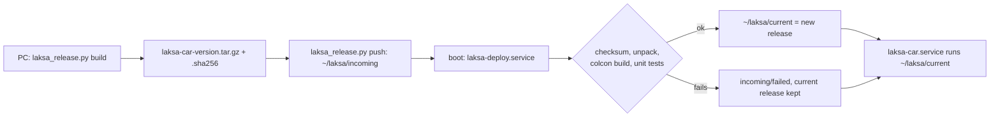

# Setup and deployment

[Index](README.md) · Previous: [Console and operation](07_console_and_operation.md) · Next: [Performance optimization](09_performance_optimization.md)

## Target machine

This work runs on a **bench Jetson**, not the original car computer: an Orin Nano Super developer kit with JetPack 6 (L4T R36.5) and Ubuntu 22.04, user `samyak`. It was set up to match the car's software stack. The ESP32, VESC, LiDAR and ZED are attached to it.

The micro-ROS agent that bridges the ESP32 (FastDDS, `ROS_DOMAIN_ID=0`, not localhost-only), and a health service, were already installed as boot services under another account. They are **reused and never restarted**, and the ESP32's serial port is never opened directly.

## One-time setup

Scripts are in `firmware/esp32-s3/jetson/setup/`.

| Step | Script | What it does |
|---|---|---|
| 1 | `sudo bash 01_system_setup.sh` | Adds the ROS 2 Humble apt source and installs the stack's packages (Nav2, RTAB-Map, robot_localization, SLAM Toolbox, laser_filters, joy, CycloneDDS…). Runs `rosdep init` and writes `/etc/laksa/`. **Doesn't** upgrade packages, install udev rules or services, change groups or open serial devices. |
| 2 | `bash 02_build_workspaces.sh` | Builds as the normal user, with no sudo. `~/third_party/third_party_ws` gets `sllidar_ros2` and `rf2o_laser_odometry` pinned to the car's commit plus `patches/rf2o-laser-odometry-laksa.patch`. `~/laksa_ws` gets `laksa_interfaces` and all Jetson packages, **symlinked** to the repo checkout at `~/src/Project_LAKSA`. Packages only need the third-party workspace from this step. |
| 3 | ZED wrapper | `zed-ros2-wrapper` built in `~/zed_ws` against the ZED SDK 5.5 already on the machine. The user must be in the `zed` group. |
| 4 | `laksa_release.py push --now` (from the PC) | Installs the deployer and the first car package; see [Deploying code changes](#deploying-code-changes). Needs passwordless sudo for `samyak` to install the systemd units. |

Differences from the original car:
- The apt RTAB-Map is **0.23.7**; the car ran 0.22.1.
- `laksa_dense_map` hit an OpenCV clash between JetPack's build and ROS's. It was fixed with a linker alias inside `~/laksa_ws`, recorded in `02_build_workspaces.sh`. That package isn't launched.

## Launcher

`setup/dryrun_bringup.sh` starts every process from [System architecture](02_system_architecture.md#process-map):

| Command | Effect |
|---|---|
| `dryrun_bringup.sh start` | everything, supervisor actuation **disabled** (brake only); cap 1000 eRPM / 0.24 m/s |
| `dryrun_bringup.sh trial` | everything, actuation **enabled**; supervisor cap **4,200 eRPM (about 1.0 m/s)**, driver 0.6 m/s by default (console slider up to 1.0), Nav2 at 0.22 m/s. Was 620 eRPM / 0.15 m/s until 29 Sep |
| `dryrun_bringup.sh race` | actuation enabled, **no operator needed**; ARM in the console, the car starts on a green signal and stops on red; up to 3.0 m/s |
| `dryrun_bringup.sh auto` | trial or race, whichever was chosen on the console (default trial); used by `laksa-car.service` |
| `dryrun_bringup.sh console` | restart only the console, bound to the current network |
| `dryrun_bringup.sh stop` | stop every process it started |
| `dryrun_bringup.sh status` | show what's running |

In start and trial modes the car stays braked until an operator starts driving. In race mode it stays braked until a race is armed and started.

**Launcher overrides** (from KarSha's route tooling, validated before start by `check_overrides`): `LAKSA_NAV_ERPM`, `LAKSA_CRUISE_ERPM`, `LAKSA_DRIVER_CAP`, `LAKSA_BT_XML`, `LAKSA_NAV_EXTRA`, `LAKSA_NAV_CMD_TOPIC`. Unset means the per-mode defaults above. See the header of `dryrun_bringup.sh`.

The launcher also starts Nav2: `controller_server`, `planner_server`, `behavior_server`, `bt_navigator` and the lifecycle manager. They use `laksa_bringup/config/nav2_ackermann.yaml` plus `laksa_learned_driver/config/nav2_field_overrides.yaml`. The override switches route following to **Regulated Pure Pursuit** with reversing, on **Reeds-Shepp** plans (three-point turns). In an isolated simulation of an 8 x 6 m room it reached 4/4 goals with no collisions, where the production MPPI follower dithered (0/4) and forward-only planning could not turn the car around. Controller and BackUp output go to `/laksa/nav_cmd_vel`, the supervisor's navigation input. `LAKSA_NAV=0` skips Nav2. Stopping the whole stack takes 60–90 s.

## Boot services

Unit files are in `firmware/esp32-s3/jetson/systemd/`, installed to `/etc/systemd/system/` by the deployer (see [Deploying code changes](#deploying-code-changes)):

| Service | What it does |
|---|---|
| `laksa-deploy.service` | Runs once at every boot as `samyak`, **before** `laksa-car`. Moves old logs into `~/laksa_logs`, prunes the oldest sessions, and installs the newest package waiting in `~/laksa/incoming` (build and tests first). Runs `~/laksa/bin/laksa_deploy.sh boot`. |
| `laksa-car.service` | Runs as `samyak` after the network is up and after `laksa-deploy`. Waits 25 s for USB devices and the micro-ROS agent to settle, then runs `~/laksa/current/src/firmware/esp32-s3/jetson/setup/dryrun_bringup.sh auto`. `stop` runs `dryrun_bringup.sh stop`. |
| `laksa-network-watch.service` | Runs as root, from `~/laksa/current`. Starts and stops the hotspot and restarts `laksa-car` when the console's network changes (see [Console and operation](07_console_and_operation.md#networking-at-the-field)). |

Until the first package is installed, `laksa-car` and `laksa-network-watch` still run from `~/src/Project_LAKSA`; the deployer switches them over once the first package has built.

Restart the stack:

```bash
sudo systemctl restart laksa-car
```

## Sessions and recording

Everything a run writes goes to **`~/laksa_logs`** on the Jetson:

| Folder | Content |
|---|---|
| `~/laksa_logs/sessions/<YYYYMMDDTHHMMSS>_boot<id>/` | one folder per `start`, `trial` or `race` run |
| `~/laksa_logs/deploy/` | the deployer's log for every boot: which package was installed, build output, failures |

Each session folder holds:

| File | Content |
|---|---|
| `session.txt` | mode, actuation, caps and start time |
| `<process>.log` | each process's output |
| `decisions.csv` | the learned driver's per-scan decision log ([Runtime safety](05_runtime_safety.md#decision-log)) |
| `rtabmap.db` | that session's map database |
| `bag/` | rosbag of scans, commands, brake, driver status, supervisor state, perception JSON, odometry, VESC and ESP32 state, `/joy`, TF and `/map`. No camera video, to keep it small. |

`~/laksa_run/latest` points at the newest session. The ZED obstacle point cloud isn't recorded; `decisions.csv` already has the distances.

- **Boot id in the name.** The Jetson has no RTC battery, so every boot starts at the same saved clock time (03:15 on 1 Oct) until NTP syncs, and at the field it never syncs. With the time alone, a new boot reused the last run's folder and overwrote its logs. Times inside the logs can be wrong for the same reason.
- **Pruning.** At boot the deployer deletes the oldest sessions while `sessions/` is over **100 GB** or the disk has under **50 GB** free (`LAKSA_SESSIONS_MAX_GB`, `LAKSA_DISK_MIN_FREE_GB`). The newest session is never deleted. The last 50 deploy logs are kept.
- **Old location.** Sessions before 1 Oct were in `~/laksa_sessions`. The first boot with the deployer moves them into `~/laksa_logs/sessions` and leaves `~/laksa_sessions` as a symlink, so old paths still work.
- **Power loss.** A run cut by pulling the battery leaves `decisions.csv` readable (it is flushed every row), but the rosbag has no index and is usually unreadable.

## Deploying code changes

The car runs a **package**: one `.tar.gz` made from a commit, unpacked into its own folder at boot and built there. Deploys no longer copy files into `~/src/Project_LAKSA`, which is KarSha's working checkout.



On the Jetson:

| Path | Content |
|---|---|
| `~/laksa/incoming/` | packages waiting to install; `installed/` and `failed/` keep the handled ones |
| `~/laksa/releases/laksa-car-<utc>-<sha>/` | `src/` (the package's source), `ws/` (its own colcon workspace), `install.sh`, `MANIFEST.json` (commit, branch, build time) |
| `~/laksa/current`, `~/laksa/previous` | symlinks to the running release and the one before it |
| `~/laksa/bin/laksa_deploy.sh` | the deployer, updated from each release it installs |

A package contains `firmware/esp32-s3/jetson` and `laksa_interfaces` from the **committed** HEAD; uncommitted changes are refused. Each release builds its own workspace against the shared, prebuilt `~/third_party/third_party_ws` and `~/zed_ws`. The launcher uses the release's `ws/` when there is one, else `~/laksa_ws`. The four newest releases plus `current` and `previous` are kept.

From the PC, in the repo, build a package:

```bash
python firmware/esp32-s3/jetson/release/laksa_release.py build
```

Copy the newest package to the car. The first time on a Jetson this also installs the deployer and `laksa-deploy.service`. The package installs at the **next boot**:

```bash
python firmware/esp32-s3/jetson/release/laksa_release.py push
```

Or install it now (build and tests take a few minutes, then the car stack restarts):

```bash
python firmware/esp32-s3/jetson/release/laksa_release.py push --now
```

On the Jetson, see what's installed:

```bash
~/laksa/bin/laksa_deploy.sh status
```

Go back to the previous release and restart the car stack:

```bash
~/laksa/bin/laksa_deploy.sh rollback
```

A package whose build or tests fail is never switched on: it moves to `~/laksa/incoming/failed`, the car keeps its current release, and the reason is in `~/laksa_logs/deploy/`.

**Trial install without touching the car:** set `LAKSA_ROOT` and `LAKSA_LOG_ROOT` to scratch folders and `LAKSA_NO_SYSTEM=1`. The deployer then unpacks and builds there and leaves systemd, `~/laksa/bin` and `~/laksa_sessions` alone.

**The old way (before 1 Oct)** copied changed files into `~/src/Project_LAKSA` with `tar` over SSH and rebuilt `~/laksa_ws`. That overwrote KarSha's working files once (29 Sep), and every copy needed file modes reset with `chmod`. Never "undo mode changes" with `git checkout -- <file>`: it also restores the old **contents** and silently drops the deploy. This happened with `zed_base_pose_adapter.py`; see [Performance](09_performance_optimization.md#deploy-regression-found-on-the-way).

### Tests

`release/install.sh` runs the learned driver's unit tests on the Jetson for every package. On the PC, the `test` folders clash with Python's own `test` package, so run the files directly:

```bash
cd firmware/esp32-s3/jetson/laksa_learned_driver && PYTHONPATH=. python test/test_learned_driver.py
```

Last run (1 Oct): learned driver 60, hold latch 8, training tracks 2, bringup contracts and control math 26, all passing.

## Bench tools

These talk to the ESP32 **directly, bypassing the supervisor**. They are for wheels-up bench tests only, with the supervisor stopped.

| Tool | Test | Aborts on |
|---|---|---|
| `setup/steering_bench.py` | sweeps steering about 9° left and 7° right, with traction held at 0 | any wheel motion, VESC fault, stale telemetry, another `/laksa/command` publisher |
| `setup/traction_bench.py` | slow speed steps (at most 0.30 m/s) with active braking between them; reports measured eRPM for calibration | more than 2500 eRPM, motor current above 8 A, sustained rotation against the command, VESC fault, stale telemetry, another publisher |

If either tool dies, the ESP32's 500 ms watchdog stops and centres the wheels.
